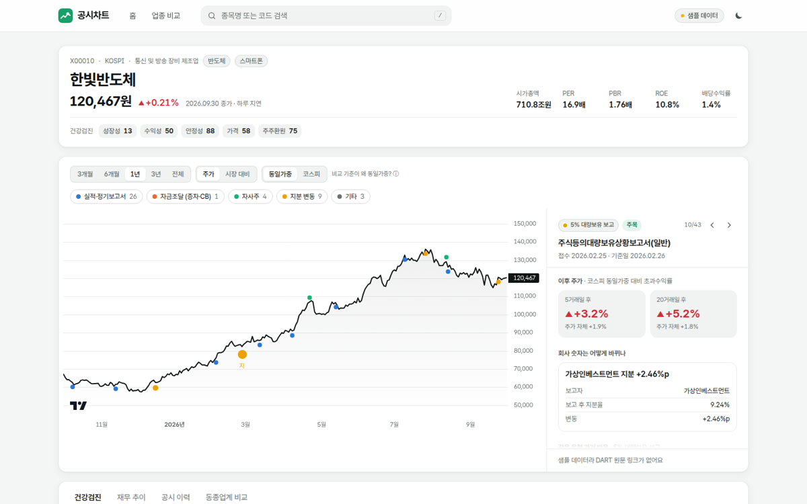
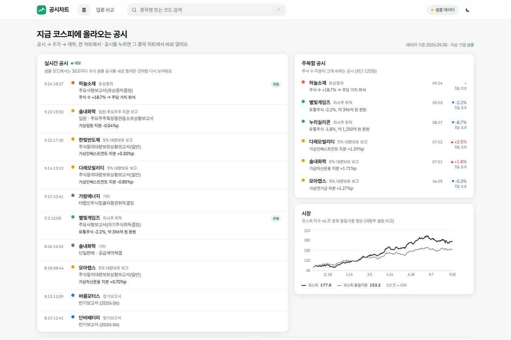
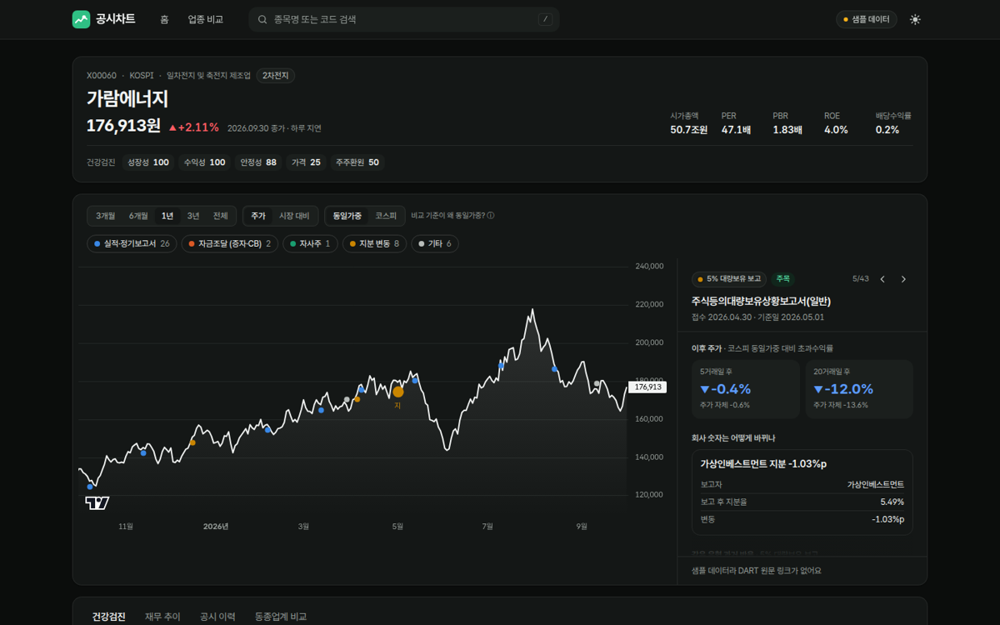
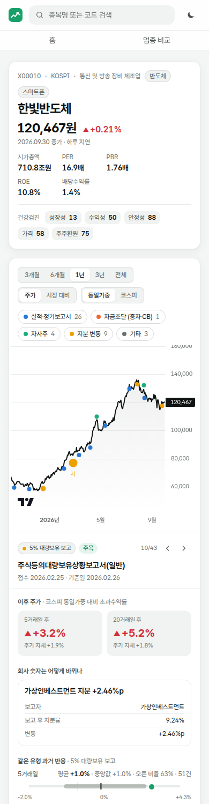
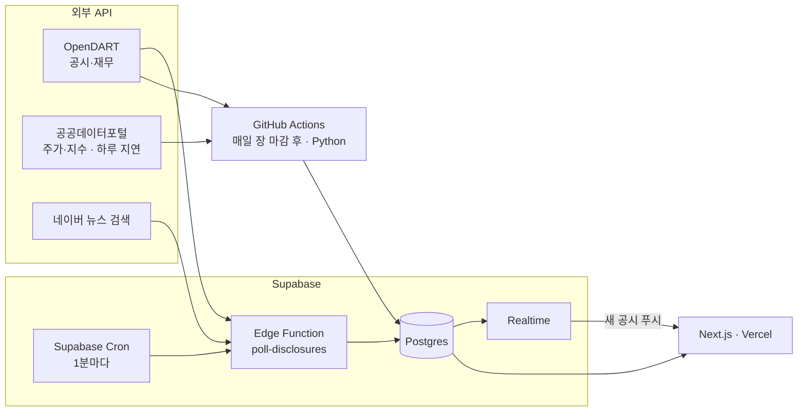

# DARTanalysis · 공시차트

> **공시가 뜰 때마다 주가가 어떻게 움직였고 회사 숫자는 어떻게 바뀌었는지를, 종목의 재무 체력과 함께 차트 위에서 보여주는 DART 기반 주가 분석 대시보드.**
> 공시 → 주가 → 재무, 한 차트에서.



| 홈 (실시간 공시 피드) | 다크 모드 | 모바일 |
|---|---|---|
|  |  |  |

- 범위: **코스피 전 종목** (v1) · 웹 기반 · 공시·뉴스는 실시간, 주가는 일별
- 레퍼런스: [FACT CHART](http://factchart.co.kr/) (공시 × 주가 패턴)
- 기능 명세서: Notion `DART 공시·주가 분석 대시보드 — 기능 명세서 v0.1`
- 서비스 이름 `공시차트`는 임시 이름 (`web/lib/site.ts` 한 곳에서 변경)

> ⚠️ 지금 저장소에 들어 있는 화면 데이터는 **가상 기업·가상 공시로 만든 샘플**입니다 (종목코드가 `X`로 시작). API 키와 Supabase를 연결하면 실제 코스피 데이터로 바뀝니다.

---

## 1. 무엇을 보여주나

| 화면 | 내용 |
|---|---|
| **종목 페이지** (핵심) | 주가 차트 위에 공시를 점으로 표시 → 점을 누르면 오른쪽 패널에 ① 공시 후 5·20거래일 **초과수익률** ② **재무 영향** (유상증자 희석률, 자사주 매입 규모 등) ③ **같은 유형 과거 반응 분포** ④ 관련 뉴스 |
| 하단 탭 | **건강검진**(5개 항목 업종 내 백분위) · **재무 추이** · **공시 이력**(표) · **동종업계 비교**(ROE × PBR) |
| 홈 | 실시간 공시 피드, 주목할 공시, 코스피 vs 동일가중 평균, 공시 유형별 평균 반응, 테마별 등락 |
| 업종 비교 | 투자 테마 / 공식 분류(KSIC) 전환, 상위 3사 매출 점유율, ROE × PBR, 성장성 × 수익성 |

## 2. 구조



- **상시 서버가 없음** → 잠들 서버도, 깨우는 핑도 필요 없음. 무료 티어로 운영 가능.
- 무거운 계산(공시 후 수익률, 건강검진, 밸류에이션)은 **배치에서 미리** 하고, 웹은 **읽기만** 한다.

```
DARTanalysis/
├─ web/                     Next.js 16 (App Router) + Tailwind 4 + Lightweight Charts + Recharts
│  ├─ app/                  홈 · /stock/[code] · /sectors
│  ├─ components/           화면 컴포넌트 (stock/, home/, sectors/)
│  └─ lib/                  데이터 레이어(mock | supabase), 형식, 색상 토큰
├─ pipeline/                Python 데이터 파이프라인
│  ├─ dartpipe/clients/     OpenDART · 공공데이터포털 · 네이버 API
│  ├─ dartpipe/*.py         분류 · 분기 재무 변환 · 이벤트 스터디 · 재무 영향 · 밸류에이션 · 건강검진
│  ├─ dartpipe/jobs/        backfill(최초 1회) · daily(매일) · check_apis(키 점검)
│  ├─ dartpipe/mock/        가상 기업 샘플 데이터 생성기
│  └─ tests/                pytest 37개 (로컬 Postgres로 백필 전체 흐름까지 검증)
├─ supabase/                DB 스키마(migrations) · Edge Function · 크론 SQL
└─ .github/workflows/       ci(테스트·빌드) · daily-batch(일일 배치)
```

## 3. 바로 실행해보기 (키 없이, 샘플 데이터)

```bash
cd web
npm install
npm run dev          # http://localhost:3000
```

샘플 데이터를 다시 만들고 싶으면 (실제 분석 코드를 그대로 통과해서 만들어짐):

```bash
cd pipeline
python -m venv .venv && source .venv/bin/activate
pip install -r requirements.txt
python -m dartpipe.mock.generate     # → web/lib/mock/data.json
python -m pytest -q                  # 테스트
```

## 4. 실제 데이터 연결하기

### ① API 키 발급
| 키 | 어디서 | 비고 |
|---|---|---|
| `DART_API_KEY` | [opendart.fss.or.kr](https://opendart.fss.or.kr) → 인증키 신청 | 개인은 바로 발급, 하루 2만 건 |
| `DATAGOKR_SERVICE_KEY` | [data.go.kr](https://www.data.go.kr) → `금융위원회_주식시세정보`, `금융위원회_지수시세정보` 활용신청 | "일반 인증키(Decoding)" 사용 |
| `NAVER_CLIENT_ID/SECRET` | [developers.naver.com](https://developers.naver.com) → 애플리케이션 등록(검색) | 선택. 없으면 뉴스만 빠짐 |

```bash
cp .env.example .env      # 값 채우기 (.env는 깃에 안 올라감)
cd pipeline && python -m dartpipe.jobs.check_apis    # 키가 동작하는지 1건씩 호출해 확인
```

### ② Supabase
1. 프로젝트 생성 → SQL Editor에서 `supabase/migrations/0001~0003.sql` 순서대로 실행
2. `.env`에 `SUPABASE_DB_URL` (상단 **Connect → Session pooler** URI) 추가
3. 과거 데이터 채우기: `python -m dartpipe.jobs.backfill --years 5`
   (DART 한도 때문에 이틀에 나눠질 수 있음. 멈추면 다음 날 같은 명령 → 캐시로 이어서 진행. 시험은 `--years 1 --limit 20`)

### ③ 실시간 공시 (Edge Function + Cron)
```bash
supabase functions deploy poll-disclosures
supabase secrets set DART_API_KEY=... CRON_SECRET=아무-긴-랜덤문자열 NAVER_CLIENT_ID=... NAVER_CLIENT_SECRET=...
```
그다음 `supabase/cron.sql`의 Vault 값(프로젝트 URL, CRON_SECRET)을 바꿔서 SQL Editor에서 실행.
**크론 시간은 UTC 기준** (한국 시간 − 9시간)이라 파일 안에 미리 변환해 둠.

### ④ 일일 배치 (GitHub Actions)
저장소 **Settings → Secrets → Actions**에 `DART_API_KEY`, `DATAGOKR_SERVICE_KEY`, `SUPABASE_DB_URL`, (선택) 네이버 키 등록.
평일 20:17(KST)에 자동 실행. 키가 없으면 실패하지 않고 건너뜀. 백필도 Actions 탭에서 수동 실행 가능.

### ⑤ 웹 배포 (Vercel)
Root Directory = `web`, 환경변수 `DATA_SOURCE=supabase`, `NEXT_PUBLIC_SUPABASE_URL`, `NEXT_PUBLIC_SUPABASE_ANON_KEY`.

## 5. 갱신 주기와 API 한도

| 작업 | 방식 | 주기 | 하루 호출(대략) |
|---|---|---|---|
| 새 공시 확인 | 주기 | 평일 07~20시 1분, 그 외 30분 | ~800 (DART 한도의 4%) |
| 공시 상세(증자·CB·자사주·지분) | 이벤트 | 해당 공시가 뜰 때 | 수십~수백 |
| 뉴스 | 이벤트 | 공시 발생 시 + 30분 뒤 1회 | 수백 (네이버 한도의 수 %) |
| 주가·시가총액·지수 | 주기 | 매일 1회 (한 번에 전 종목) | 몇 회 |
| 재무 | 이벤트 | 정기보고서가 뜬 회사만 | 평소 수십, 보고서 시즌 수천 |
| 점수·통계 재계산 | 계산 | 매일 주가 갱신 직후 | 0 |

호출 수는 `api_usage` 테이블에 기록되고, 하루 예산(`DART_DAILY_BUDGET`, 기본 18,000)에 닿으면 멈춘 뒤 다음 날 이어서 진행.

## 6. 설계 결정 (왜 이렇게 했나)

- **공식 업종 분류 ≠ 실제 경쟁 구도** → DART 업종코드(KSIC)는 통계용이라 회사마다 하나만 붙고, 대표 반도체 기업들이 서로 다른 업종으로 갈리기도 함. 그래서 **투자 테마 분류**를 따로 두고 화면에서 전환 가능.
- **코스피 쏠림 보정** → 코스피 지수는 대형주 몇 개 비중이 매우 큼(2026년 6월 기준 상위 2종목 약 56%). 공시 후 수익률의 기본 비교 기준을 **전 종목 동일가중 평균**으로 직접 계산해 사용, 코스피 지수 기준도 함께 제공.
- **공시 시각 문제** → DART 공시검색 API는 날짜만 준다. 실시간 수집이 **처음 발견한 시각**을 저장해 장중(당일 기준)/장 마감 후(다음 거래일 기준)를 나눔. 시각이 없는 과거 공시는 보수적으로 다음 거래일.
- **분기 누적 재무 → 분기 값** → 분·반기 보고서는 누적 금액이라, 4분기 = 연간 − 3분기 누적. 현금흐름표는 누적만 주므로 차분.
- **미래 정보 사용 방지** → 재무 숫자는 보고서 **공시일부터** 밸류에이션에 반영.
- **통계를 예측처럼 보이지 않게** → 평균(상·하위 1% 제외)과 함께 중앙값·오른 비율·표본 수·분포를 보여주고, 표본 5건 미만은 숨김. 거래정지·액면분할(상장주식 수 20% 이상 변화)·초소형주는 제외.
- **건강검진은 임의 가중치 없음** → 5개 항목을 업종 내 백분위로만 표시하고 합산하지 않음. 업종 회사 수가 5개 미만이면 코스피 전체 기준.
- **실시간 주가는 넣지 않음** → 거래소 시세를 공개 웹에 보여주려면 정보이용계약이 필요. 주가는 공공데이터(하루 지연), **공시·뉴스만 실시간**.
- **색은 계산해서 검증** → 공시 마커 색은 차트에서 위·아래 두 줄로 나눠 찍고, 같은 줄 안의 색 조합이 색약·정상 시각 모두에서 구분되는지 검증 스크립트로 확인. 상승=빨강/하락=파랑(한국 관례).

## 7. 현재 상태와 한계

- ✅ 파이프라인 분석 로직 + 로컬 Postgres 통합 테스트 통과, 웹 빌드·린트 통과, 가상 데이터로 전 화면 동작
- ⚠️ **실제 API로는 아직 실행하지 않음** (개발 환경에서 DART·공공데이터 API 접속이 막혀 있었음). 응답 형식은 각 API 개발가이드 기준으로 작성 → 첫 실행 때 `check_apis`로 확인 필요
- ⚠️ 공공데이터 가격은 수정주가가 아님 → 분할·병합 구간은 분석에서 제외하는 방식으로 대응
- 금융업(은행·보험·증권)은 v1에서 건강검진·밸류에이션 계산 제외
- 후순위: 코스닥150, 스크리너, DCF·역DCF, 몬테카를로 DCF, 리포트 PDF 내보내기

## 8. 출처·라이선스

데이터: 금융감독원 OpenDART, 금융위원회 주식시세정보·지수시세정보(공공데이터포털), 네이버 검색 API.
차트: [TradingView Lightweight Charts](https://github.com/tradingview/lightweight-charts) (Apache-2.0, 차트에 TradingView 로고 표기) · 폰트: Pretendard (OFL-1.1).
과거 통계이며 투자 권유가 아닙니다.
